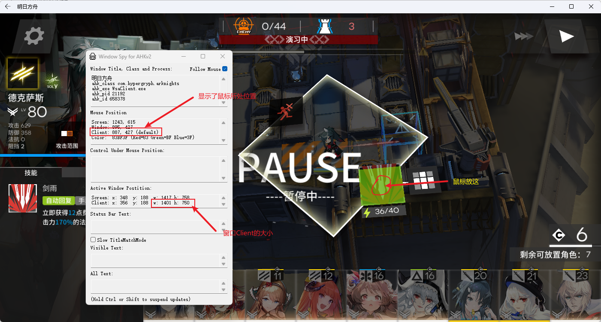

# README

> AHKScript for game Arknights running as a WSA program.

# 前言

	电脑上开Hyper-v后，原来的蓝叠不能用了。正好不想看广告了，就特地去弄了个WSA版本的明日方舟。然鹅，WSA没有热键，划不了火柴，这简直忍不了，所以我就写了一个热键脚本，通过按键模拟点击操作。

---

# 使用

1. 官网安装[AutoHotkey](https://www.autohotkey.com/)
2. 窗口：长宽比被设置为了1920*1040（在我的电脑全屏下的Client大小）。宽度改变后高度会自动等比例变化。
3. 常用功能及热键：

    * 技能：鼠标右键（`RBUTTON`​）
    * 暂停：空格（`Space`​），以及默认的Esc
    * 撤退干员：鼠标的前进肩键（`XButton2`​​）

# 热键及位置调整

1. 热键调整：编辑.ahk文件，对照[按键列表(键盘, 鼠标和控制器) | AutoHotkey v2 (wyagd001.github.io)](https://wyagd001.github.io/v2/docs/KeyList.htm)提供的按键列表修改热键
2. 位置调整：使用Window Spy挨个测量3种功能对应位置在整个窗口下的比例，如图

    ​​​​

‍
